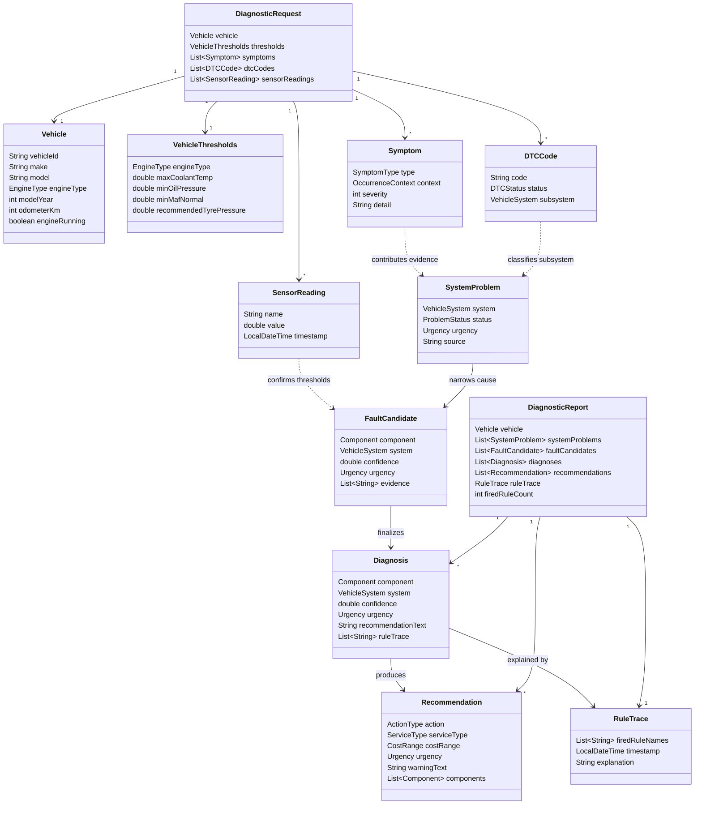

# Vehicle Fault Diagnostics Class Diagram

```mermaid
classDiagram
    class Vehicle {
        String vehicleId
        String make
        String model
        EngineType engineType
        int modelYear
        int odometerKm
        boolean engineRunning
    }

    class VehicleThresholds {
        EngineType engineType
        double maxCoolantTemp
        double minOilPressure
        double minMafNormal
        double recommendedTyrePressure
    }

    class Symptom {
        SymptomType type
        OccurrenceContext context
        int severity
        String detail
    }

    class DTCCode {
        String code
        DTCStatus status
        VehicleSystem subsystem
    }

    class SensorReading {
        String name
        double value
        LocalDateTime timestamp
    }

    class SystemProblem {
        VehicleSystem system
        ProblemStatus status
        Urgency urgency
        String source
    }

    class FaultCandidate {
        Component component
        VehicleSystem system
        double confidence
        Urgency urgency
        List~String~ evidence
    }

    class Diagnosis {
        Component component
        VehicleSystem system
        double confidence
        Urgency urgency
        String recommendationText
        List~String~ ruleTrace
    }

    class Recommendation {
        ActionType action
        ServiceType serviceType
        CostRange costRange
        Urgency urgency
        String warningText
        List~Component~ components
    }

    class RuleTrace {
        List~String~ firedRuleNames
        LocalDateTime timestamp
        String explanation
    }

    class DiagnosticRequest {
        Vehicle vehicle
        VehicleThresholds thresholds
        List~Symptom~ symptoms
        List~DTCCode~ dtcCodes
        List~SensorReading~ sensorReadings
    }

    class DiagnosticReport {
        Vehicle vehicle
        List~SystemProblem~ systemProblems
        List~FaultCandidate~ faultCandidates
        List~Diagnosis~ diagnoses
        List~Recommendation~ recommendations
        RuleTrace ruleTrace
        int firedRuleCount
    }

    DiagnosticRequest "1" --> "1" Vehicle
    DiagnosticRequest "1" --> "1" VehicleThresholds
    DiagnosticRequest "1" --> "*" Symptom
    DiagnosticRequest "1" --> "*" DTCCode
    DiagnosticRequest "1" --> "*" SensorReading
    Symptom ..> SystemProblem : contributes evidence
    DTCCode ..> SystemProblem : classifies subsystem
    SensorReading ..> FaultCandidate : confirms thresholds
    SystemProblem --> FaultCandidate : narrows cause
    FaultCandidate --> Diagnosis : finalizes
    Diagnosis --> Recommendation : produces
    Diagnosis --> RuleTrace : explained by
    DiagnosticReport "1" --> "*" Diagnosis
    DiagnosticReport "1" --> "*" Recommendation
    DiagnosticReport "1" --> "1" RuleTrace
```
